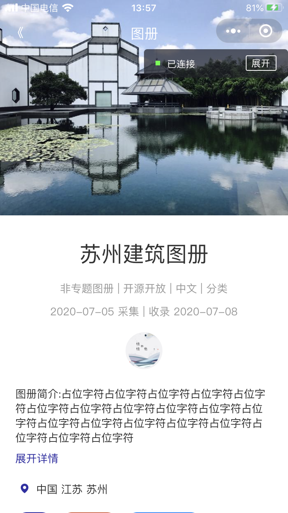
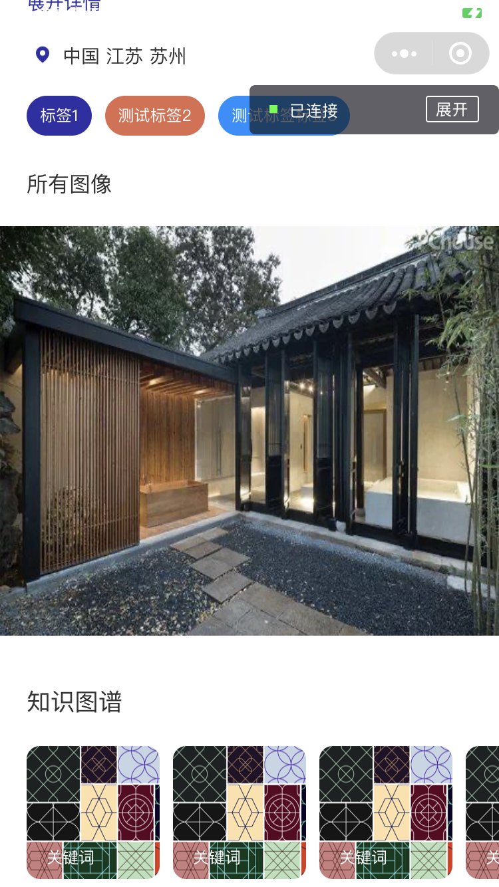

### [English](https://github.com/HeXavi8/ACIMG) | 中文


# 

ACIMG旨在由全国大学生共同创建全国范围内的文物古建的图像数据集。这通过专题图像征集活动形式开展，比如，岭南建筑图像专题，由广东地区大学生，利用手机等拍摄设备，针对求学或者家乡所在地典型岭南建筑进行拍照获得图像（照片），然后上传到ACIMG系统。

为有效支持建筑图像的采集过程，ACIMG系统构建包括ACIMG Web平台，和ACIMG微信小程序等客户端，方便用户上传、查看建筑图像数据集。建筑图像数据集的图像组织结构为ACIMG平台-专题-图册-图像。

ACIMG汇聚的海量建筑图像数据，将为建筑历史、建筑艺术文化研究提供基础数据资产，同时，也可有效支撑迁移应用，指将建筑艺术文化指导其他方面的创新创意营造等。比如AI风格画，用户可选用ACIMG图像数据中的合适照片，通过AI算法，生成富有艺术品位的建筑主题绘画。

项目仍在开发过程中。

## 目录
* [截图](#Snapshots)
* [使用](#Usage)
* [项目成员](#Project_Members)
* [License](#License)

## 截图 <a name="Snapshots"></a>

&emsp;&emsp;&emsp;

## 使用 <a name="Usage"></a>

请克隆仓库，并运行在微信开发者工具中。(目前为止只有前端代码)

在app.js中，后端传输的文件类型是json，请参考 [demo.json](./data/demo.json) 和 [album.json](./data/album.json)

```
  globalData: {
    userInfo: null,
    //Transfer files that are deployed in the database
    //The format can be referred to demo.json and album.json
    jsonUrlPrefix: "https://xxxx.xxxxxxxx.com/json/",
    imgUrlPrefix:"https://xxxx.xxxxxxxx.com/zimg/"
  }
```

## 项目成员 <a name="Project_Members"></a>
- [Xavi](https://github.com/HeXavi8) - **Xavi He** &lt; 825308876@qq.com&gt; &lt; yuminghe.work@outlook.com&gt;(he/him)
- [Chen Cantao](https://github.com/JustForStudy064) - **Chen Cantao** &lt; 844523879@qq.com&gt; (he/him)

我们的代码和设计远非完美。如果您有任何建议或想贡献代码，请随时联系我们或作出拉请求。 </br>

## License <a name="License"></a>
[MIT](./LICENSE)
