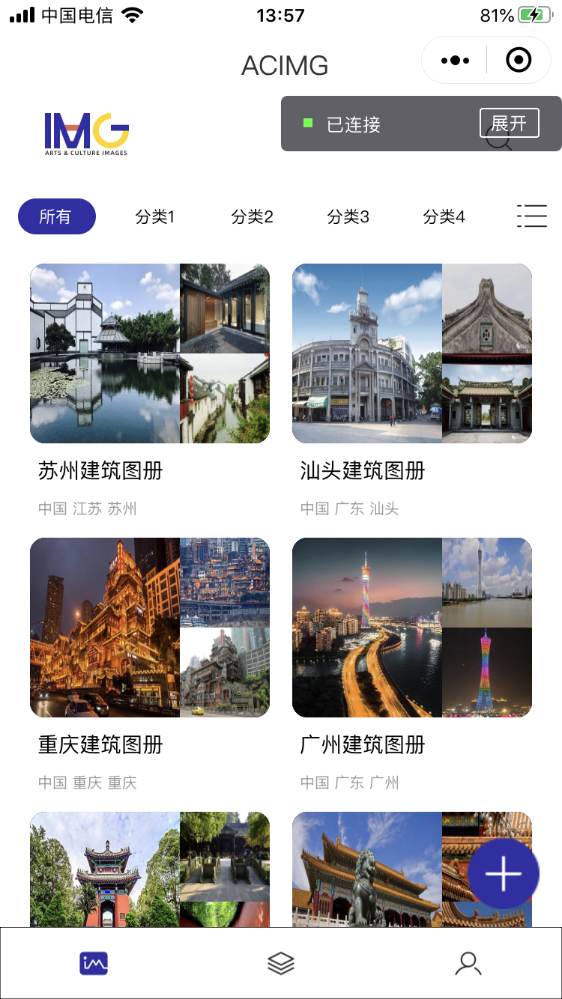
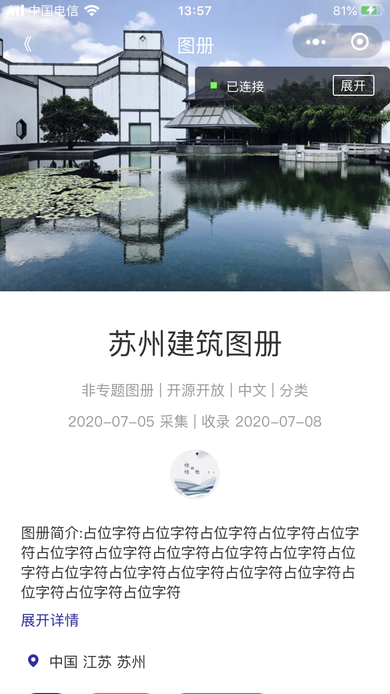
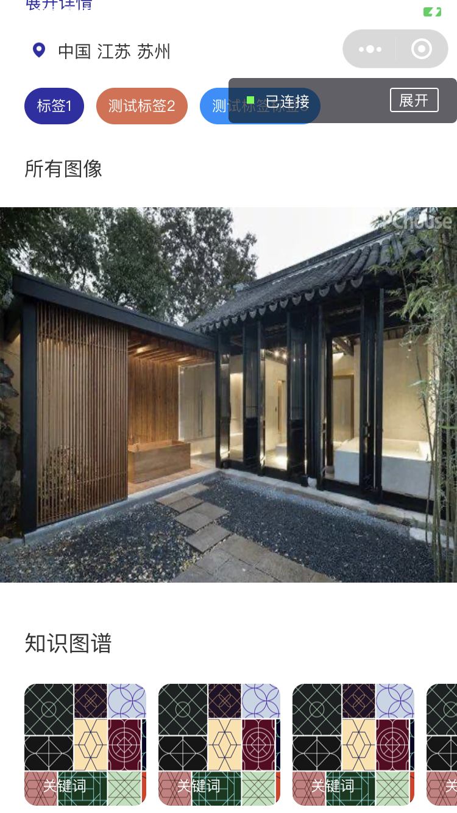
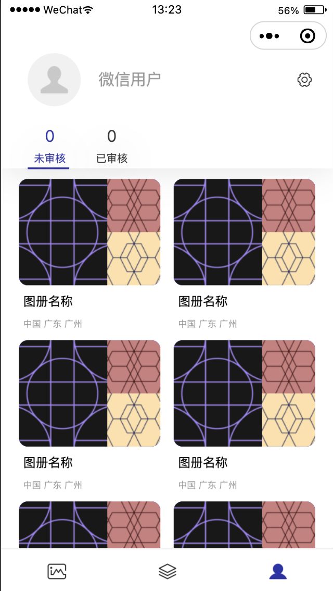

### English | [中文](./Chinese_Introduction)

# 

ACIMG(Arts & Culture Images) aims to create a nationwide image dataset of cultural relics and ancient buildings by college students from all over the country.  For example, in the image project of Lingnan architecture, college students in Guangdong take pictures of typical Lingnan buildings in their study places or hometown with mobile phones and other photographing equipment and then upload them to the ACIMG system.

To effectively support the acquisition process of architectural images, the ACIMG system consists of ACIMG Web platform, ACIMG Wechat Mini Program, and other client terminals, which are convenient for users to upload and view architectural images data sets. The image organization structure of the architectural image data set is ACIMG platform - thematic - atlas - image.

The massive architectural image data collected by ACIMG will provide primary data assets for studying architectural history and architectural art and culture. At the same time, it can also effectively support migration and application, which means that architectural art and culture can guide the innovation and creation of other aspects. For example, users can select appropriate photos from ACIMG image data in AI-style paintings and generate artistic architectural theme paintings through the AI algorithm.

This project is still under development.

## Table of Contents
* [Snapshots](#Snapshots)
* [Usage](#Usage)
* [Project Members](#Project_Members)
* [License](#License)

## Snapshots <a name="Snapshots"></a>

&emsp;&emsp;&emsp;

## Usage <a name="Usage"></a>

Please clone the repository and run in Wechat Dvetools. (Front-end code only so far)

In app.js, the type of back-end files is json, please refer to [demo.json](./data/demo.json) and [album.json](./data/album.json)

```
  globalData: {
    userInfo: null,
    //Transfer files that are deployed in the database
    //The format can be referred to demo.json and album.json
    jsonUrlPrefix: "https://xxxx.xxxxxxxx.com/json/",
    imgUrlPrefix:"https://xxxx.xxxxxxxx.com/zimg/"
  }
```

## Project Members <a name="Project_Members"></a>
- [Xavi](https://github.com/HeXavi8) - **Xavi He** &lt;825308876@qq.com&gt;(he/him)
- [Chen Cantao](https://github.com/JustForStudy064) - **Chen Cantao** &lt;844523879@qq.com&gt; (he/him)

Our code and design are far from perfect. If you have any suggestions or would like to contribute to this repository, please feel free to contact us or make pull requests. </br>

## License <a name="License"></a>
[MIT](./LICENSE)
