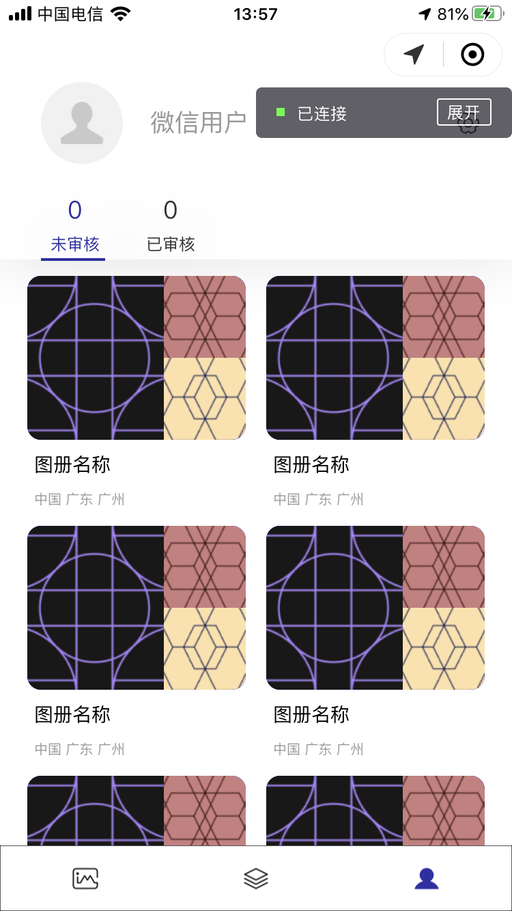

### English | [中文](./Chinese_Introduction)

# 

ACIMG (Arts & Culture Images) aims to create a nationwide image dataset of cultural relics and ancient buildings through contributions from college students across the country. For example, in the Lingnan architecture image project, college students in Guangdong photograph typical Lingnan buildings in their study locations or hometowns using mobile phones and other photography equipment**,** then upload them to the ACIMG system.

To effectively support the image acquisition process**,** the ACIMG system consists of the ACIMG Web platform, ACIMG WeChat Mini Program, and other client terminals, which facilitate users in uploading and viewing architectural image datasets. The organizational structure of the architectural image dataset follows a hierarchy of: ACIMG platform → theme → atlas → image.

The massive architectural image data collected by ACIMG will provide essential data assets for studying architectural history and architectural art and culture. Additionally, it can effectively support knowledge transfer and application, enabling architectural art and culture to guide innovation and creation in other fields. For example, users can select appropriate photos from the ACIMG image database for AI-style paintings and generate artistic architectural themed paintings through AI algorithms.

This project is currently under development.

## Table of Contents
* [Snapshots](#Snapshots)
* [Usage](#Usage)
* [Project Members](#Project_Members)
* [License](#License)

## Snapshots <a name="Snapshots"></a>

&emsp;&emsp;&emsp;

## Usage <a name="Usage"></a>

Please clone the repository and run in Wechat Dvetools. (Front-end code only so far)

In app.js, the type of back-end files is json, please refer to [demo.json](./data/demo.json) and [album.json](./data/album.json)

```
  globalData: {
    userInfo: null,
    //Transfer files that are deployed in the database
    //The format can be referred to demo.json and album.json
    jsonUrlPrefix: "https://xxxx.xxxxxxxx.com/json/",
    imgUrlPrefix:"https://xxxx.xxxxxxxx.com/zimg/"
  }
```

## Project Members <a name="Project_Members"></a>
- [Xavi](https://github.com/HeXavi8) - **Xavi He** &lt;825308876@qq.com&gt;(he/him)
- [Chen Cantao](https://github.com/JustForStudy064) - **Chen Cantao** &lt;844523879@qq.com&gt; (he/him)

Our code and design are far from perfect. If you have any suggestions or would like to contribute to this repository, please feel free to contact us or make pull requests. </br>

## License <a name="License"></a>
[MIT](./LICENSE)
